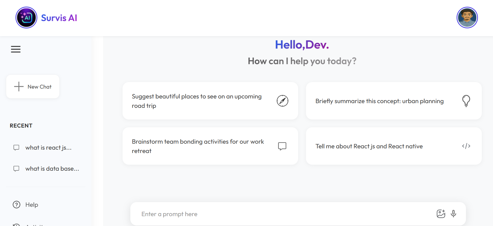
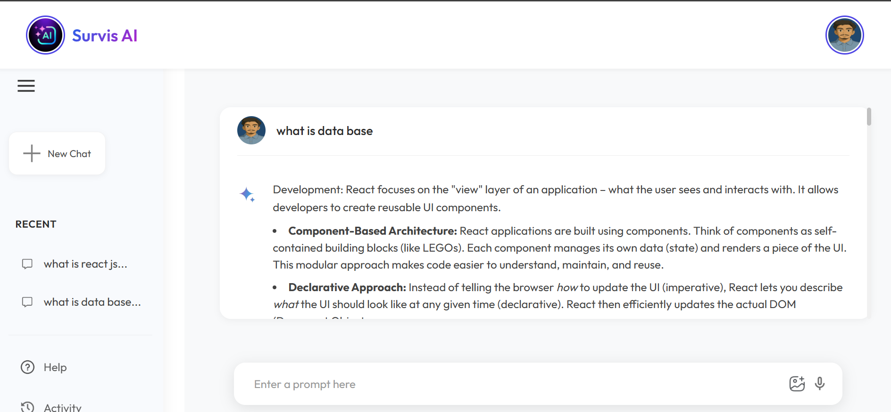

# 🤖 Survis AI – Your Smart Chat Companion

Survis AI is an intelligent chatbot built using the Gemini API that enables real-time, human-like conversations. Designed for both assistance and casual interaction, Survis AI processes user input and responds with contextually relevant answers. The project demonstrates how large language models can be integrated into a modern web interface to build interactive and responsive applications.

---

## 🔗 Live Site

🌐 [View Live Website](https://survisai.netlify.app/)

---

## 📸 Screenshots

  

---

## 🌟 Features

-💬 Real-time text-based interaction
-🔗 Powered by Google’s Gemini API
-🖥️ Clean and responsive user interface
-⚠️ Robust error handling for API requests
-🔧 Easily customizable and extendable

---

## 🚀 Tech Stack

- **React** (with hooks and components)
- **React Router DOM** (v6+)
- **HTML5 & CSS3**
- **JavaScript (ES6+)**
- **API Integration: Gemini API** (Google's Generative AI)

---

## 📫 Contact
- If you have any feedback or suggestions, feel free to reach out!

- 📧 Email:surajitmandal@gmail.com

- 💼 LinkedInn: https://www.linkedin.com/in/surajit-mandal-b7148a306/

